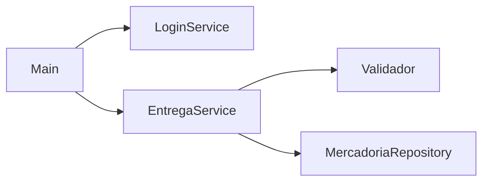

# Projeto Entregas

Sistema Java de console para controle de mercadorias e seus endereços de entrega. Depois do login, o sistema cadastra uma mercadoria de demonstração e lista as mercadorias cadastradas.

## Instalação

Requisitos:
- Java 17 ou superior (JDK)
- Maven 3.8 ou superior

Para compilar e executar:

```bash
mvn clean package
java -cp target/classes br.edu.entregas.Main
```

Também dá para usar os scripts prontos, que fazem as duas coisas: `executar-linux.sh` ou `executar-windows.bat`.

Se aparecer `UnsupportedClassVersionError`, o `java` do PATH é mais antigo que o 17. Ajuste o PATH ou rode com o Java do JDK 17 (`%JAVA_HOME%\bin\java` no Windows).

## Configuração

O sistema não usa arquivo de configuração nem variáveis de ambiente. As configurações ficam em dois lugares:

- `pom.xml`: versão do projeto, versão do Java (17) e encoding UTF-8.
- `LoginService.java`: usuário e senha de acesso, definidos nas constantes `USUARIO` e `SENHA`. Para alterar, edite e recompile.

Se os acentos aparecerem como `?` no terminal, rode com `-Dstdout.encoding=UTF-8` (Java 19+) ou `-Dsun.stdout.encoding=UTF-8` (Java 17). No Windows, `chcp 65001` antes de executar também resolve.

Arquivos como `config/application.properties` e `*.env` estão no `.gitignore` e não devem ser versionados.

## Arquitetura

O projeto é dividido em camadas:

- `Main`: entrada pelo console, pede usuário e senha e mostra o resultado.
- `service`: `LoginService` faz a autenticação e `EntregaService` cadastra e lista mercadorias.
- `repository`: `MercadoriaRepository` guarda as mercadorias em memória.
- `model`: `Mercadoria` e `Endereco`.
- `util`: `Validador`, usado no cadastro para validar os campos obrigatórios.



Cada mercadoria possui exatamente um endereço de entrega. Nome e descrição são obrigatórios, peso e valor precisam ser positivos e o endereço não pode ser nulo.

## Uso

Ao iniciar, informe usuário e senha. Para demonstração:

- Usuário: `admin`
- Senha: `12345678`

Com credenciais corretas, o sistema mostra a mercadoria cadastrada:

```
=== SISTEMA DE ENTREGAS ===
Usuário: admin
Senha: 12345678
Acesso autorizado. Mercadorias cadastradas:
#1 | Notebook | Notebook corporativo | 2.1 kg | R$ 4500,00 | AGUARDANDO ENVIO | Entrega: Av. Goiás, 1000 - Sala 8, Goiânia/GO - CEP: 74000-000
```

Se o usuário ou a senha estiverem errados, aparece `Acesso negado.` e o programa encerra. Os dados ficam só em memória, então são perdidos ao fechar.

## Manutenção

Use branches de funcionalidade, Pull Request e revisão antes do merge. Não faça commit direto na `main` e não versione credenciais.

Os commits seguem o padrão `feat:`, `fix:`, `docs:`, `refactor:` e `chore:`.

Antes de abrir um PR, confira se:
- `mvn clean package` compila sem erro;
- `admin` / `12345678` autentica e credenciais erradas não;
- a mercadoria é listada com o endereço.

A tag `v1.0.0-funcional` marca a última versão estável antes do resgate e serve de referência para comparar mudanças (`git diff v1.0.0-funcional -- <arquivo>`).

Pontos a melhorar: credenciais fixas no código, ausência de testes automatizados e persistência apenas em memória.

## Versionamento

Esta documentação é versionada junto com o código. Qualquer mudança que afete instalação, configuração ou uso deve atualizar o README no mesmo PR, com commit `docs:`.
