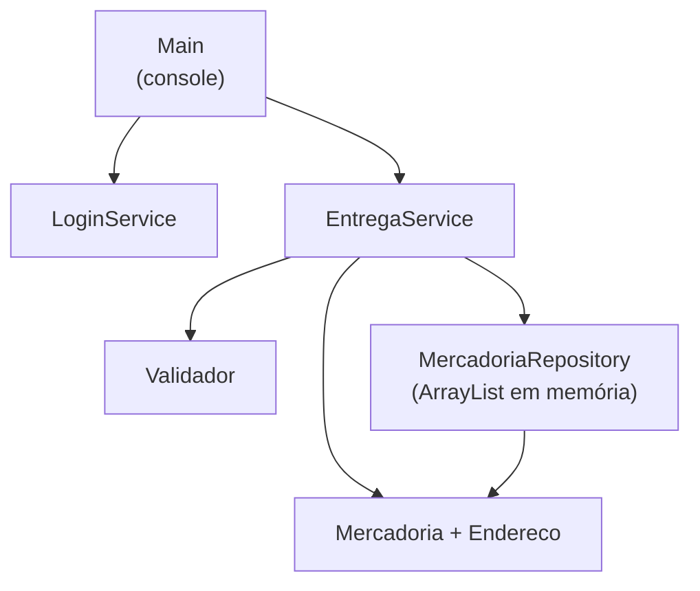
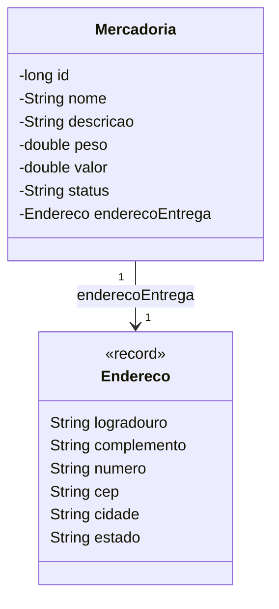
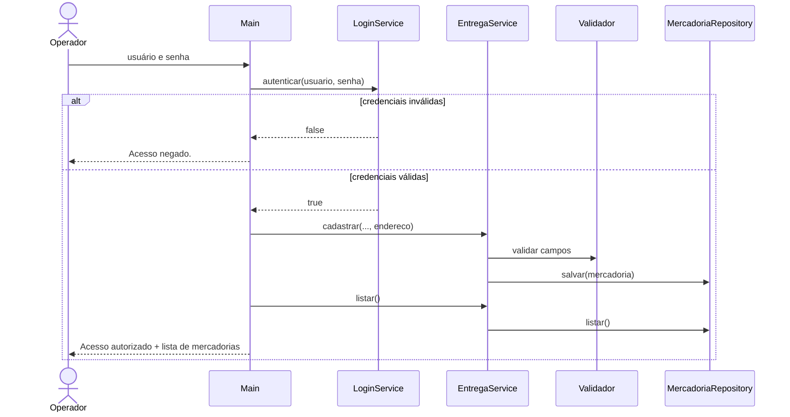

# Projeto Entregas

Sistema Java de console para controle de mercadorias e seus endereços de entrega.

| Item | Valor |
| --- | --- |
| Versão do sistema | 1.0.0 (`pom.xml`) |
| Versão desta documentação | 1.1 (05/10/2026) |
| Linguagem | Java 17 |
| Build | Maven |
| Persistência | Em memória (sem banco de dados) |

## Sumário

1. [Visão geral](#1-visão-geral)
2. [Documentação de instalação](#2-documentação-de-instalação)
3. [Documentação de configuração](#3-documentação-de-configuração)
4. [Documentação de arquitetura](#4-documentação-de-arquitetura)
5. [Documentação de usuário](#5-documentação-de-usuário)
6. [Documentação de manutenção](#6-documentação-de-manutenção)
7. [Versionamento da documentação](#7-versionamento-da-documentação)
8. [Referências](#8-referências)

---

## 1. Visão geral

O Projeto Entregas autentica um operador e, após o login, cadastra mercadorias vinculadas a um endereço de entrega e lista o que foi cadastrado.

Regra central do modelo: **cada mercadoria possui exatamente um endereço de entrega**. Não existe mercadoria sem endereço.

Público de cada seção deste documento:

| Seção | Público |
| --- | --- |
| Instalação e configuração | Quem vai compilar e executar o sistema |
| Arquitetura e manutenção | Desenvolvedores que vão evoluir ou corrigir o código |
| Usuário | Quem vai operar o sistema no console |

---

## 2. Documentação de instalação

### 2.1 Requisitos

| Software | Versão mínima | Observação |
| --- | --- | --- |
| JDK (Java Development Kit) | 17 | Precisa ser o JDK, não apenas o JRE, porque o Maven compila o código |
| Apache Maven | 3.8 | Ferramenta de build |
| Git | Qualquer versão recente | Necessário apenas para clonar o repositório |

O projeto não depende de bibliotecas externas. Na primeira compilação o Maven baixa apenas os próprios plugins de build, então é preciso acesso à internet nessa etapa.

### 2.2 Verificar o ambiente

```bash
java -version
mvn -version
```

As duas saídas devem indicar Java 17 ou superior. No `mvn -version`, confira a linha `Java version`: é ela que mostra qual JDK o Maven vai usar.

### 2.3 Obter o código

```bash
git clone https://github.com/AugustoMorais222/Projeto-Entregas-Escape-Room.git
cd Projeto-Entregas-Escape-Room
```

### 2.4 Compilar

```bash
mvn clean package
```

O build termina com `BUILD SUCCESS`. As classes compiladas ficam em `target/classes` e o pacote em `target/projeto-entregas-1.0.0.jar`.

### 2.5 Executar

```bash
java -cp target/classes br.edu.entregas.Main
```

Também existem scripts que compilam e executam em um único passo:

| Sistema operacional | Comando |
| --- | --- |
| Linux / macOS | `bash executar-linux.sh` |
| Windows | `executar-windows.bat` |

### 2.6 Problemas comuns na instalação

| Sintoma | Causa | Solução |
| --- | --- | --- |
| `UnsupportedClassVersionError` ao executar | O `java` do PATH é anterior ao 17 (por exemplo, Java 8) | Ajustar o PATH para o JDK 17 ou executar com o caminho completo: `"%JAVA_HOME%\bin\java"` no Windows, `$JAVA_HOME/bin/java` no Linux |
| `release version 17 not supported` no build | O Maven está usando um JDK antigo | Definir `JAVA_HOME` apontando para o JDK 17 e abrir um novo terminal |
| `mvn` não é reconhecido como comando | Maven não instalado ou fora do PATH | Instalar o Maven e incluir a pasta `bin` dele no PATH |
| `Could not find or load main class br.edu.entregas.Main` | O projeto não foi compilado ou o comando foi executado fora da raiz do projeto | Rodar `mvn clean package` na raiz do projeto antes de executar |
| `PluginResolutionException` no build | Sem acesso ao repositório central do Maven | Verificar conexão ou proxy de rede |

---

## 3. Documentação de configuração

### 3.1 Parâmetros de build (`pom.xml`)

| Parâmetro | Valor atual | Efeito |
| --- | --- | --- |
| `groupId` | `br.edu.entregas` | Identificador do grupo do projeto e pacote raiz |
| `artifactId` | `projeto-entregas` | Nome do artefato gerado |
| `version` | `1.0.0` | Versão do sistema; compõe o nome do `.jar` |
| `maven.compiler.source` / `maven.compiler.target` | `17` | Versão da linguagem e do bytecode gerado |
| `project.build.sourceEncoding` | `UTF-8` | Codificação dos arquivos-fonte; preserva os acentos das mensagens |

Para gerar uma nova versão, altere `version` no `pom.xml` e crie uma tag Git correspondente (ver [seção 7](#7-versionamento-da-documentação)).

### 3.2 Parâmetros de execução (JVM)

O sistema não lê variáveis de ambiente próprias. O comportamento de saída pode ser ajustado por propriedades da JVM:

| Propriedade | Exemplo | Efeito |
| --- | --- | --- |
| `user.language` e `user.country` | `-Duser.language=pt -Duser.country=BR` | Define o separador decimal do valor. Em pt-BR sai `R$ 4500,00`; em inglês sai `R$ 4500.00` |
| `stdout.encoding` (Java 19+) ou `sun.stdout.encoding` (Java 17 e 18) | `-Dstdout.encoding=UTF-8` | Corrige acentos exibidos como `?` no console |

Exemplo completo:

```bash
java -Duser.language=pt -Duser.country=BR -Dstdout.encoding=UTF-8 -Dsun.stdout.encoding=UTF-8 -cp target/classes br.edu.entregas.Main
```

No Windows, se os acentos continuarem errados, mude o terminal para UTF-8 antes de executar:

```bat
chcp 65001
```

| Variável de ambiente | Uso |
| --- | --- |
| `JAVA_HOME` | Não é lida pelo sistema, mas é usada pelo Maven para escolher o JDK. Deve apontar para o JDK 17 ou superior |

### 3.3 Parâmetros definidos no código

Hoje alguns valores estão fixos no código-fonte. Para alterá-los é preciso editar o arquivo e recompilar.

| Parâmetro | Arquivo | Valor atual |
| --- | --- | --- |
| Usuário de acesso | `service/LoginService.java`, constante `USUARIO` | `admin` |
| Senha de acesso | `service/LoginService.java`, constante `SENHA` | `12345678` |
| Mercadoria de demonstração | `Main.java` | Notebook, 2,1 kg, R$ 4500,00, `AGUARDANDO ENVIO` |
| Endereço de demonstração | `Main.java` | Av. Goiás, 1000, Sala 8, Goiânia/GO, CEP 74000-000 |

### 3.4 Arquivos de configuração e segredos

- O sistema **não lê nenhum arquivo de configuração externo**.
- `config/application.properties` e arquivos `*.env` estão no `.gitignore`. Se forem criados localmente para testes, **nunca devem ser versionados**.
- O commit `6572d8a` (tag `commit-perigoso`) versionou credenciais de banco e um token de API. O arquivo foi removido da versão atual, mas continua no histórico do Git. Essas credenciais devem ser tratadas como comprometidas e trocadas em qualquer ambiente onde tenham sido usadas.

Para confirmar que um arquivo está protegido pelo `.gitignore`:

```bash
git check-ignore -v config/application.properties
```

---

## 4. Documentação de arquitetura

### 4.1 Visão em camadas

O sistema segue uma arquitetura em camadas simples, sem frameworks:

| Camada | Pacote | Responsabilidade |
| --- | --- | --- |
| Apresentação | `br.edu.entregas` (`Main`) | Lê usuário e senha no console, aciona os serviços e imprime os resultados |
| Serviço | `br.edu.entregas.service` | Regras de negócio: autenticação e cadastro de mercadorias |
| Repositório | `br.edu.entregas.repository` | Armazena e lista mercadorias em memória |
| Modelo | `br.edu.entregas.model` | Entidades `Mercadoria` e `Endereco` |
| Utilitários | `br.edu.entregas.util` | Validações reutilizáveis (`Validador`) |



### 4.2 Componentes

| Classe | Descrição |
| --- | --- |
| `Main` | Ponto de entrada. Solicita credenciais, encerra com `Acesso negado.` se forem inválidas e, se forem válidas, cadastra a mercadoria de demonstração e lista as mercadorias |
| `LoginService` | `autenticar(usuario, senha)` retorna `true` somente quando usuário **e** senha conferem. A comparação usa `equals` (conteúdo da `String`), nunca `==` |
| `EntregaService` | `cadastrar(...)` valida os dados, cria a `Mercadoria` com seu `Endereco` e grava no repositório. `listar()` devolve as mercadorias cadastradas |
| `MercadoriaRepository` | Lista em memória. `salvar` adiciona e `listar` devolve uma visão somente leitura |
| `Mercadoria` | Entidade imutável: id, nome, descrição, peso, valor, status e endereço de entrega |
| `Endereco` | `record` imutável: logradouro, complemento, número, CEP, cidade e estado. O complemento é opcional |
| `Validador` | Métodos estáticos `textoObrigatorio` e `numeroPositivo`, que lançam `IllegalArgumentException` |

### 4.3 Modelo de dados



### 4.4 Regras de validação no cadastro

| Campo | Regra | Mensagem de erro |
| --- | --- | --- |
| Nome | Obrigatório, não pode ser vazio | `Nome é obrigatório.` |
| Descrição | Obrigatória, não pode ser vazia | `Descrição é obrigatório.` |
| Peso | Maior que zero | `Peso deve ser positivo.` |
| Valor | Maior que zero | `Valor deve ser positivo.` |
| Endereço | Não pode ser nulo | `Endereço é obrigatório.` |

### 4.5 Fluxo de execução



### 4.6 Tecnologias

| Tecnologia | Uso |
| --- | --- |
| Java 17 | Linguagem; usa `record` para `Endereco` |
| Maven | Compilação e empacotamento |
| Git / GitHub | Controle de versão e configuração |
| Coleções da biblioteca padrão (`ArrayList`) | Armazenamento em memória |

---

## 5. Documentação de usuário

### 5.1 Como usar

1. Inicie o sistema (ver [seção 2.5](#25-executar)).
2. Em `Usuário:`, digite `admin` e pressione Enter.
3. Em `Senha:`, digite `12345678` e pressione Enter.
4. Com o acesso autorizado, o sistema cadastra a mercadoria de demonstração e mostra a lista de mercadorias.

### 5.2 Acesso de demonstração

| Campo | Valor |
| --- | --- |
| Usuário | `admin` |
| Senha | `12345678` |

As credenciais diferenciam maiúsculas de minúsculas. Usuário ou senha incorretos não dão acesso.

### 5.3 Exemplo de sessão

```
=== SISTEMA DE ENTREGAS ===
Usuário: admin
Senha: 12345678
Acesso autorizado. Mercadorias cadastradas:
#1 | Notebook | Notebook corporativo | 2.1 kg | R$ 4500,00 | AGUARDANDO ENVIO | Entrega: Av. Goiás, 1000 - Sala 8, Goiânia/GO - CEP: 74000-000
```

### 5.4 Como ler a listagem

Cada linha da listagem é uma mercadoria, com os campos separados por `|`:

| Posição | Campo | Exemplo |
| --- | --- | --- |
| 1 | Identificador | `#1` |
| 2 | Nome | `Notebook` |
| 3 | Descrição | `Notebook corporativo` |
| 4 | Peso em quilos | `2.1 kg` |
| 5 | Valor em reais | `R$ 4500,00` |
| 6 | Status da entrega | `AGUARDANDO ENVIO` |
| 7 | Endereço de entrega | `Av. Goiás, 1000 - Sala 8, Goiânia/GO - CEP: 74000-000` |

### 5.5 Mensagens do sistema

| Mensagem | Significado | O que fazer |
| --- | --- | --- |
| `Acesso autorizado.` | Login aceito | Nada, a listagem aparece em seguida |
| `Acesso negado.` | Usuário ou senha incorretos | Executar o sistema novamente e digitar as credenciais corretas |
| Acentos aparecem como `?` | Codificação do terminal | Ver [seção 3.2](#32-parâmetros-de-execução-jvm) |

### 5.6 Limitações atuais

- O cadastro é feito automaticamente com dados de demonstração; ainda não há menu para cadastrar mercadorias digitando os dados.
- Os dados ficam apenas em memória e são perdidos ao fechar o programa.
- Após um login negado o programa encerra; para tentar de novo é preciso executá-lo outra vez.

---

## 6. Documentação de manutenção

### 6.1 Estrutura do repositório

```
.
├── pom.xml                         Configuração do build Maven
├── executar-linux.sh               Compila e executa (Linux/macOS)
├── executar-windows.bat            Compila e executa (Windows)
├── DESAFIO.md                      Enunciado do Git Escape Room
├── RELATORIO-RESGATE.md            Relatório da recuperação do projeto
└── src/main/java/br/edu/entregas
    ├── Main.java
    ├── model/        Mercadoria.java, Endereco.java
    ├── repository/   MercadoriaRepository.java
    ├── service/      EntregaService.java, LoginService.java
    └── util/         Validador.java
```

### 6.2 Fluxo de contribuição

1. Atualize a `main`: `git switch main` e `git pull`.
2. Crie uma branch a partir dela com o prefixo do tipo de trabalho: `feature/`, `fix/`, `docs/` ou `hotfix/` (exemplo: `feature/menu-cadastro`).
3. Faça commits pequenos, um assunto por commit, no padrão Conventional Commits já usado no histórico:

   | Prefixo | Uso |
   | --- | --- |
   | `feat:` | Nova funcionalidade |
   | `fix:` | Correção de defeito |
   | `docs:` | Documentação |
   | `refactor:` | Mudança de código sem alterar comportamento |
   | `chore:` | Configuração, build, `.gitignore` |

4. Rode o checklist de validação ([seção 6.4](#64-checklist-de-validação)).
5. Envie a branch e abra um Pull Request para a `main`.
6. O merge só acontece depois da revisão de outra pessoa. Use merge com commit (`--no-ff`) para manter o rastro da branch no histórico.

Não faça commit direto na `main`, não use `git push --force` em branches compartilhadas e não versione credenciais.

### 6.3 Tarefas frequentes

**Alterar usuário ou senha de acesso**
Edite as constantes `USUARIO` e `SENHA` em `LoginService.java`. Mantenha a comparação com `equals` e o operador `&&`: trocar por `||` ou `==` permite login indevido (defeito já ocorrido no commit `9a6d3b0`).

**Adicionar um campo à mercadoria**
1. Inclua o atributo e o parâmetro no construtor de `Mercadoria` e, se necessário, no `toString`.
2. Inclua o parâmetro em `EntregaService.cadastrar` e a validação correspondente com o `Validador`.
3. Atualize a chamada em `Main`.
4. Atualize as tabelas das seções 4.2, 4.3, 4.4 e 5.4 deste README.

**Criar uma nova validação**
Adicione um método estático em `Validador` que lance `IllegalArgumentException` com mensagem clara e chame-o em `EntregaService`. Antes de remover qualquer classe "aparentemente sem uso", procure referências com `git grep NomeDaClasse` (a exclusão do `Validador` no commit `64f88f6` quebrou a compilação).

**Recuperar um arquivo ou versão anterior**

```bash
git log --oneline --all --graph --decorate
git restore --source=<commit-ou-tag> -- <caminho/do/arquivo>
```

A tag `v1.0.0-funcional` marca a última versão estável antes dos defeitos e serve como linha de base para comparação: `git diff v1.0.0-funcional -- <arquivo>`.

### 6.4 Checklist de validação

Antes de abrir um Pull Request, confirme:

| Verificação | Comando ou ação | Resultado esperado |
| --- | --- | --- |
| Compilação | `mvn clean package` | `BUILD SUCCESS` |
| Login válido | `admin` / `12345678` | `Acesso autorizado.` |
| Senha incorreta | `admin` / `errada` | `Acesso negado.` |
| Usuário incorreto | `joao` / `12345678` | `Acesso negado.` |
| Cadastro | Login válido | Mercadoria listada com endereço de entrega |
| Segredos | `git ls-files config` e `git grep -n -i "password\|token" HEAD -- src` | Nenhum resultado |
| Documentação | Leitura deste README | Seções afetadas pela mudança atualizadas |

### 6.5 Débitos técnicos conhecidos

| Item | Impacto | Sugestão |
| --- | --- | --- |
| Credenciais fixas no código | Trocar a senha exige recompilar, e ela fica visível no repositório | Ler de variável de ambiente ou de um arquivo não versionado |
| Credenciais no histórico (commit `6572d8a`) | Senha do banco e token continuam recuperáveis com `git show` | Trocar as credenciais; reescrever o histórico só com acordo da equipe |
| Sem testes automatizados | Regressões só aparecem na execução manual | Adicionar JUnit e testes para `LoginService` e `EntregaService` |
| Status como texto livre e sem validação | Permite status vazio ou inconsistente | Integrar a validação da branch `feature-cadastro` (`2624e5c`) e evoluir para `enum` |
| Id informado manualmente | Permite ids repetidos | Gerar o id no repositório |
| Persistência em memória | Dados perdidos ao encerrar | Persistir em arquivo ou banco de dados |
| Mensagem `Descrição é obrigatório.` | Erro de concordância | Ajustar o `Validador` para receber a mensagem completa |

---

## 7. Versionamento da documentação

Esta documentação fica no próprio repositório e é versionada junto com o código. Toda mudança que altere instalação, configuração, arquitetura ou uso deve atualizar o README **no mesmo Pull Request**, com commit do tipo `docs:`.

Ao publicar uma versão do sistema:

1. Atualize `version` no `pom.xml`.
2. Registre a mudança na tabela abaixo.
3. Crie a tag: `git tag -a vX.Y.Z -m "descrição"` e `git push origin vX.Y.Z`.

### Histórico

| Versão da documentação | Data | Referência no Git | Alterações |
| --- | --- | --- | --- |
| 1.0 | 01/09/2026 | `356ec6f` (tag `v1.0.0-funcional`) | README inicial: requisitos, compilação, acesso de demonstração e modelo |
| 1.0.1 | 02/09/2026 | `7fe8faa` (branch `docs-readme`) | Inclusão do fluxo recomendado de contribuição |
| 1.0.1 | 05/10/2026 | `7ca209a` | README recuperado após o resgate do projeto (o commit `0cd80f6` havia esvaziado o arquivo) |
| 1.1 | 05/10/2026 | Este commit | Reestruturação por tipo de documentação: instalação, configuração, arquitetura, usuário, manutenção e versionamento |
